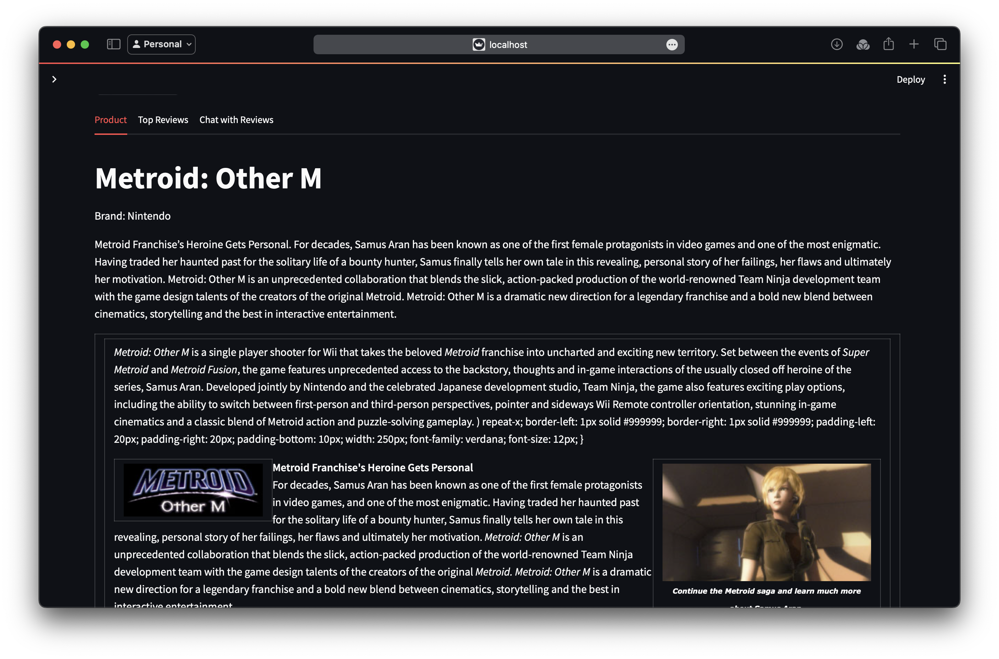

---

# GameSense: A Video Game Recommendation and Chatbot

**GameSense** is an advanced video game recommendation system that leverages both tabular data and semantic search capabilities to provide users with highly relevant game recommendations. By integrating the power of Pinecone for vector-based similarity searches and Cohere for sophisticated re-ranking, GameSense aims to deliver an enhanced user experience for finding and exploring video games. Additionally, GameSense includes a chatbot feature, allowing users to ask questions about particular games and receive detailed information using a Retrieval-Augmented Generation (RAG) technique powered by the Llama3 - 70B model.

## Features

### Hybrid Search Capabilities
- **Tabular Search**: Allows users to filter games based on categories, platforms, price range, and ratings.
- **Semantic Search**: Enables users to enter natural language queries to find games that match their search intent through semantic analysis of game reviews.

### Intelligent Recommendations
- **Combined Re-Ranking**: Utilizes Cohere's re-ranking models to sort search results by relevance, ensuring the most relevant games are displayed first.
- **Top Review Highlights**: Highlights the most relevant review for each game based on the user's search query, enhancing decision-making.

### Chatbot Integration
- **Interactive Game Queries**: Users can ask questions about specific games, and the chatbot provides detailed responses.
- **RAG Technique**: Utilizes the Llama3 - 70B model to provide accurate and contextually relevant answers by retrieving and using relevant information as context.

### User-Friendly Interface
- **Detailed Game View**: Allows users to view detailed information about each game, including specifications, price, and top reviews.

## Technologies Used

- **Python**: Core programming language for backend and frontend development.
- **Streamlit**: Framework for building the interactive web interface.
- **Pandas**: For data manipulation and handling.
- **Pinecone**: Vector database for semantic search capabilities.
- **Cohere**: API for semantic re-ranking of search results.
- **Llama3 - 70B Model using Groq**: For advanced natural language processing and chatbot functionality.
- **all-mpnet-base-v2**: Open-source embedding model for generating embeddings from user queries.
- **tiktoken**: Tokenizer for handling input text.

## Getting Started

### Prerequisites

Ensure you have the following software installed on your machine:
- Python 3.7+
- Streamlit

### Installation

1. **Clone the Repository**:
    ```bash
    git clone https://github.com/Shri-web/GameSense.git
    cd GameSense
    ```

2. **Install Required Packages**:
    ```bash
    pip install -r requirements.txt
    ```

3. **Configure Environment Variables**:
    - Set up environment variables for API keys (Cohere, Pinecone) and model configurations.

4. **Run the Application**:
    ```bash
    streamlit run app.py
    ```

## Usage

- **Home Page**: Browse the most popular games.
- **Search**: Enter a query or use the sidebar filters to find specific games.
- **View Game**: Click on a game to view detailed information and top reviews.
- **Chatbot**: Ask questions about any game and get detailed answers.

## Images




## Acknowledgements

- [Streamlit](https://streamlit.io/)
- [Pinecone](https://www.pinecone.io/)
- [Cohere](https://cohere.ai/)
- [Groq](https://groq.com/)


---

